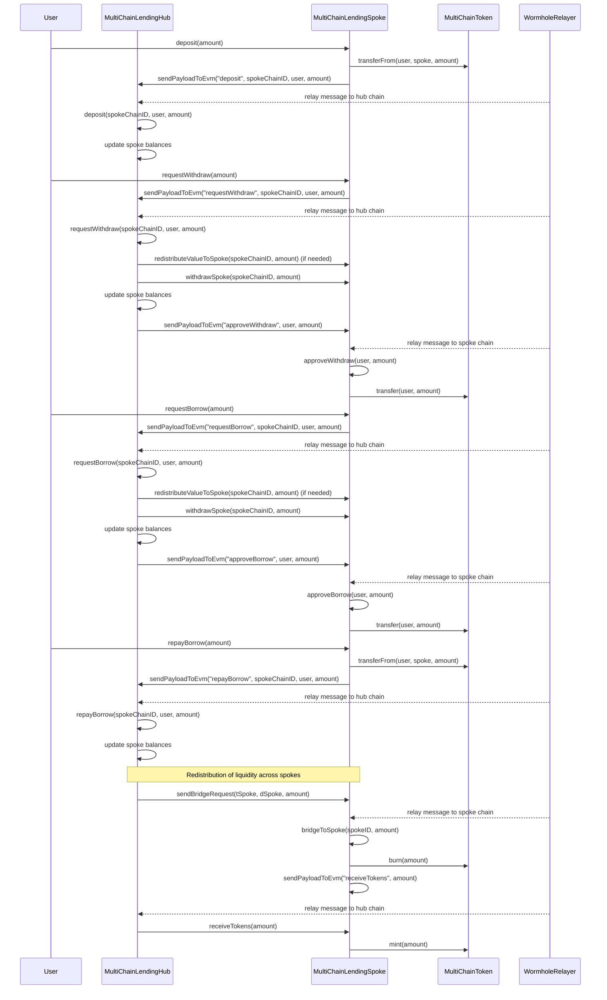

# CrossChain Defi

--> CrossChain Lending and Borrowing Defi Platform

"Seamlessly Lend, Deposit, Repay, and Redeem Across Multiple Chains."

## Overview
The Multichain Lending and Borrowing Platform is designed to empower users with the flexibility to manage their assets across various blockchain networks. 

Built with Wormhole NTT Model.

Utilizing a Hub and Spoke model, this platform facilitates seamless interoperability and liquidity, allowing users to engage in lending, depositing, repaying, and redeeming activities on different chains without the complexity typically associated with multichain operations.

## Problems It Solves
- **Fragmented Liquidity**: Traditional lending and borrowing platforms often limit users to a single blockchain, restricting their access to liquidity and yield opportunities.

- **Complex Cross-Chain Transactions**: Navigating multiple blockchains can be cumbersome and confusing, leading to user frustration and potential errors.

- **Limited Flexibility**: Users often face challenges when trying to manage their assets across different chains, particularly when it comes to repayments and redemptions.

## The Solution
The Multichain Lending and Borrowing Platform offers a comprehensive solution by leveraging the Wormhole Hub and Spoke model. This architecture allows for seamless interactions between various blockchains, enabling users to perform lending, depositing, repaying, and redeeming activities without the need for complex transactions or intermediaries.

## Features
- **Lend on Multiple Chains**: Users can lend their assets on one blockchain while benefiting from competitive interest rates.
  
- **Cross-Chain Deposits**: Easily deposit assets into different chains, maximizing yield opportunities and diversifying portfolios.

- **Flexible Repayment Options**: Repay loans on any supported chain, providing users with the freedom to manage their liabilities efficiently.

- **Instant Redemption**: Redeem assets across chains instantly, ensuring liquidity and accessibility when needed.

- **User-Friendly Interface**: A clean and intuitive interface that simplifies the multichain experience for both novice and experienced users.

- **Robust Security**: Built with top-tier security protocols to ensure the safety of user assets and transactions.

## Contract Addresses

Hub ChainiD - 10002
MultiChainLendingHub -  https://thirdweb.com/sepolia/0x76414c98ee9AD3F776054f16A351831b71870Ff3

MultiChainToken -

Sepolia -  https://thirdweb.com/sepolia/0xDe918aEf7f38AA916625d90B3Ca60D5c20B19317

BaseSepolia - 0x6E411aAE23ba8eB4EeD82e274CC32887511eCF6E

Op Sepolia - 0x9df6785ec662ff2426F1f064D4c72B82aFEd0A60

Arb Sepolia - 0x9df6785ec662ff2426F1f064D4c72B82aFEd0A60

MultiChainSpoke - 

1. https://thirdweb.com/base-sepolia-testnet/0x553126B5d9535a30fA4639adA7ADBdfdDC746AFd

2. https://thirdweb.com/op-sepolia-testnet/0xa93208bB5798bd2B7A6d56DE7F346D332088528c

3. https://thirdweb.com/arbitrum-sepolia/0xa93208bB5798bd2B7A6d56DE7F346D332088528c

## How It Works
1. **Wormhole Integration**: The platform utilizes the Wormhole protocol to facilitate cross-chain communication, ensuring that transactions are executed swiftly and securely.

2. **Hub and Spoke Model**: 
   - **Hub**: The central point where users can interact with the platform, manage their assets, and access various features.
   - **Spokes**: Individual blockchains that connect to the Hub, allowing users to lend, deposit, repay, and redeem assets across different networks.

3. **User Journey**:
   - Users start at the Hub, where they can view their assets and choose their desired action (lend, deposit, repay, redeem).
   - The platform automatically handles the necessary transactions across the relevant spokes, ensuring a smooth user experience.
   - Users receive real-time updates on their transactions, maintaining transparency and trust.

## Account Abstraction & Authentication

The MultiChain Lending and Borrowing Platform leverages Particle Network's Auth and Account Abstraction solution to provide a seamless user experience:

### Particle Auth Integration
- **Social Login Support**: Users can authenticate using email, Google, Apple, Twitter, and GitHub accounts
- **Multi-Chain Support**: Integrated with multiple EVM chains including:
  - Arbitrum Sepolia
  - Base Sepolia
  - Optimism Sepolia
- **Embedded Wallet**: Provides a built-in wallet experience with:
  - Smart account creation
  - Gas sponsorship capabilities
  - Unified transaction interface

### Account Abstraction Features
- **Smart Accounts**: Each user gets a smart contract wallet that enables:
  - Batched transactions
  - Gasless transactions
  - Multi-signature support
  - Social recovery options

### Security & User Experience
- **Master Password System**: Configurable security levels for user authentication
- **Payment Password**: Optional additional security layer for transactions
- **Seamless UX**: 
  - No seed phrases required
  - One-click social login
  - Unified wallet interface across all supported chains

### Technical Implementation
The platform uses Particle Network's ConnectKit which provides:
- Customizable UI components
- Multi-chain wallet connections
- Built-in authentication flows
- Automatic smart account deployment
- Cross-chain transaction management

This implementation allows users to interact with the lending and borrowing features across multiple chains without dealing with the complexity of managing multiple wallets or handling cross-chain transactions manually.

## UML Diagramatic Flow

Diagram to illustrate the flow and interactions between the `MultiChainLendingHub`, `MultiChainLendingSpoke`, and `MultiChainToken` contracts in your multi-chain lending application.

### Explanation:
1. **Deposit Flow**:
    - The user deposits funds to the spoke contract, which then communicates with the hub via Wormhole Relayer to update the balance on the hub.

2. **Withdraw Flow**:
    - The user requests a withdrawal, and the request is sent from the spoke to the hub. The hub checks and redistributes liquidity if needed, then approves the withdrawal, which is executed on the spoke.

3. **Borrow Flow**:
    - Similar to the withdraw flow, the user requests a borrow, which is processed on the hub, and upon approval, the spoke executes the loan to the user.

4. **Repay Flow**:
    - The user repays the borrowed amount, which is communicated from the spoke to the hub to update the balances.

5. **Liquidity Redistribution**:
    - If a spoke lacks liquidity for a withdrawal or loan, the hub redistributes liquidity across spokes by sending cross-chain messages to balance the required amounts.

## Conclusion

The Multichain Lending and Borrowing Platform is revolutionizing the way users interact with blockchain technology. By providing a seamless, user-friendly experience and addressing the challenges of liquidity and interoperability, this platform empowers users to maximize their financial potential across multiple chains. Join us in redefining the future of decentralized finance!
